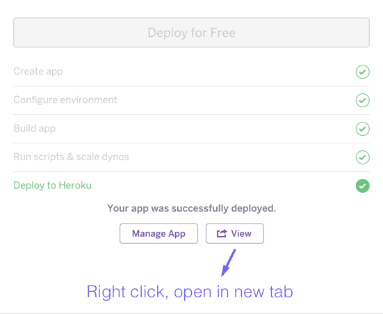
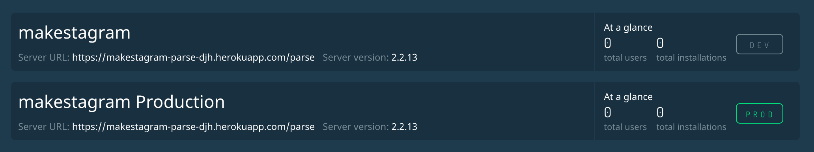

In this section you will set up your own Parse server. In the next section, you will set up the dashboard, which will provide a nice interface to interact with your Parse server. The content of this tutorial is as follows:

1. What is Parse? What is Heroku?
1. Create a Heroku Account
1. Set up Parse Server
1. Set up Parse Dashboard

# What is Parse?

## Background
Parse (was) a mobile _backend as a service_ company and product that was acquired by Facebook in April 2013. The idea was to allow individual mobile developers to build apps without having to worry about servers.

The role of the _backend_ in an internet application often revolves around _data persistence_. That means saving the user's data "in the cloud" (your backend servers) so that when they lose their phone, all their data will still be there when they reinstall your app. In reality, its much more complicated than that, often because applications require specialized business logic. But for many developers Parse is (and was) enough to ship an amazing app, without worrying about writing backend code.

In January 2016, Parse announced that it was going to shut down its platform, but would be _open-sourcing_ the software and tools needed to run your own Parse server. Through the effort of the community, and some work by Make School, you can now run your own Parse server with two simple, one-click setups!

The bad news? Parse had a generous free plan that is now gone, and has now shifted some of the burden of worrying about servers back to the developer.

The good news? You don't have to write your own backend for an infinite number of projects, ideas, hacks, and applications because the now open source Parse Server will power them all!

## What it does
Parse lets you store your _structured data_, handle files such as images, and even manages your users' logins and social network connections!

# What is Heroku?

## Background
Heroku is a _PaaS (Platform as a Service)_, that allows you to run code in the cloud without having to think too much about the infrastructure needed to make it happen. It's quite powerful because it takes very little work to deploy code - often it's as simple as typing `git push heroku master` into your terminal. Targeting Heroku involves utilizing best practices for deploying code to the cloud. There are some downsides to using a service like Heroku, but they often only matter if you're dealing with a massive amount of users. The downsides include: less choice in technology, high cost to performance ratio, and less control over individual servers. However, in many cases a service like Heroku will pay for itself in time saved.

## What it does
Heroku lets you take a repository of code, push your changes, and within minutes they are live on the internet!

# Create a Heroku Account

Because we are going to set up your Parse Server and Dashboard on Heroku, you will need a free Heroku account to get started.

## Exisiting Users
If you know you have a Heroku account, visit [Heroku Dashboard](https://dashboard.heroku.com). If not, skip to "Create an Account"

Log in if prompted, and when you see this dashboard screen, you can close the tab for Heroku and move on to the next section.

## Create an Account
1. Visit  the registration page [Heroku Signup](https://signup.heroku.com)
1. Fill out the following info:
  * First Name
  * Last Name
  * Email
  * Company Name (Skip)
  * Pick your primary development language (Select one, or choose "I use another language")
1. Click "Create Free Account". You should see a page telling you to check your email to complete setup.
1. Check your email for a message with the subject "Confirm your account on Heroku"
1. Click the activation link, it will look similar to: https://id.heroku.com/account/accept/1234567/long-hex-token
1. Enter a strong password. Heroku requires a strong password.
1. Enter the same strong password again
1. Uncheck the box for emails if you prefer
1. Click "Set Password and Login".
1. You should see a confirmation screen. Click the "Click here to proceed as {your email address}"
1. When you see the Heroku Dashboard, you can close that tab and continue on this tutorial.


# Set up Parse Server

## Deploy!

1. Visit [ParsePlatform/parse-server-example](https://github.com/ParsePlatform/parse-server-example) on GitHub.
1. Find and click the purple "Deploy to Heroku" button. 

1. Because you are already logged in, you should see a screen to configure your deployment of Parse Server.
1. Choose an app name. This is required. It can only contain letters, numbers and dashes. If you're doing [Make School's Makestagram Tutorial](https://github.com/MakeSchool-Tutorials/Makestagram-Swift-V2) you can try something like "makestagram-parse-abc" where "abc" are your initials. You will need to use this name again, so we'll refer to it as `APP_NAME` Your app name will be used by Heroku to generate your server's URL, so the name must be unique within all of Heroku.
1. Scroll down to the config section and choose an `APP_ID`. It should have no spaces or special characters, and you can call it anything you want. This name will be used within Parse to refer to your app. If this is your first ever Parse app, you could call it "FirstApp". Or if you already have a name for what you are going to be building, you could use that. For people doing the [Makestagram Tutorial](https://github.com/MakeSchool-Tutorials/Makestagram-Swift-V2), you can just call it "makestagram".
1. Next is the master key. This key alone controls everything about your Parse server, and should be made very difficult to crack. It should not be your password. You can bash random keys on your keyboard, or you can open up your terminal, and use the following command
```
openssl rand -base64 32 | tr -d '\r\n' | pbcopy
```
That command will create a random 32 character secure string, remove the return from it, and copy it to your clipboard. Paste it into the `MASTER_KEY` box. Make sure you store your `MASTER_KEY` somewhere safe. Your `MASTER_KEY` will allow access to all of your user's data, so *really*, keep it safe! It should be treated like a real key. Never put it in your code or repository.
1. Update the `SERVER_URL` with your `APP_NAME` from above with the following format  "https://`APP_NAME`.herokuapp.com/parse. For example, if your `APP_NAME` is "makestagram-parse-abc" then your `SERVER_URL` will be "https://makestagram-parse-abc.herokuapp.com/parse". **Make sure to use "https" instead of "http"**!!!
1. Go back to the previous step. **Did you use https:// for your `SERVER_URL`**? Good. You can move onto the next step now.
1. Click "deploy for free" and watch as your server is deployed.
1. *Do not click anything else on this page yet, and do not close the tab* - we need these settings for the next step.
1. When the page says "Your app was successfully deployed." You are ready for the next step, but again, *don't close this tab* or click on anything else on this page.


# Set up Parse Dashboard

By this point you will have deployed an instance of Parse Server, which is where your user's data will be stored. But you will also want another server running Parse Dashboard, which will give you a nice web interface to interact with your Parse Server.

## Deploy!

1. Visit [MakeSchool-Tutorials/Parse-Dashboard-Heroku](https://github.com/MakeSchool-Tutorials/Parse-Dashboard-Heroku) on GitHub.
1. Find and click the purple "Deploy to Heroku" button. 
1. Because you are already logged in, you should see a screen to configure your deployment of Parse Dashboard.
1. Choose an App Name (Optional). Can only contain letters, numbers and dashes. You can let Heroku create one for you, or, you can just replace "parse" with "dashboard" in your previous `APP_NAME`. For example, "makestagram-dashboard-abc" This name must be unique within all of Heroku.
1. We're going to use the exact same `APP_ID`, `MASTER_KEY` and `SERVER_URL` values from your Parse Server deployment for the Parse Dashboard. Take the `APP_ID`, `MASTER_KEY`, and `SERVER_URL` from the tab we asked you to leave open and paste each in their respective fields. **Make sure that `SERVER_URL` starts with "https://"**!!!
1. Go back to the previous step. **Did you use https:// for your `SERVER_URL`**? Good. You can move onto the next step now.
1. Choose a `USERNAME` and `PASSWORD` for your Parse Dashboard. This password will be stored in plain text on Heroku, so you don't want to use your normal password. How about a 12 character random string?
```
openssl rand -base64 12 | tr -d '\r\n' | pbcopy
```
Make sure you store your password somewhere safe. Your password will allow access to all of your user's data, so *please* keep it safe!
1. Click "deploy for free" and watch as your second server is deployed.
1. Do not click anything else on this page yet, and *do not close the tab*. We will need to refer back to this configuration.
1. When the page says "Your app was successfully deployed." You are ready for the next step, but again, *don't close this tab yet*.
1. Right-click (or two-finger tap, or control click) the "View" button at the bottom of the page and click "open in a new tab". 
1. In that new tab, you should be prompted for your `USERNAME` and `PASSWORD`
1. Once you're logged in, you should look something like this, but with your `APP_ID` and `SERVER_URL`:


Congratulations! You've deployed Parse!