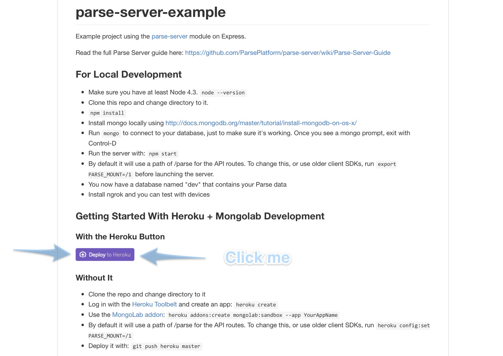

In this tutorial you will setup your own Parse server. In the next tutorial, you will setup the dashboard to interact with your parse server.

1. What is Parse? What is Heroku?
1. Setting up Heroku
1. Setting up the Server
1. Setting up the dashboard
1. Completion

# What is Parse?

## Background
Parse (was) a mobile Backend as a Service company/product that was purchased by Facebook. The idea was, let individual mobile developers build apps, without having to worry about servers.

The role of the Backend in an internet application revolves around data persistence. In reality, its much more complicated than that, usually because of different application requiring specialized business logic. But for many developers Parse is (and was) enough to ship an amazing app without worrying about servers, and what was on them.

This year, Parse announced that it was going to shut down its platform, but would be open-sourcing the software and tools needed to run your own. Through community efforts, and some effort by members of this team, you can now run your own Parse with two, one-click setups!

The bad news? Parse had a generous free plan that is now gone, and has now shifted the burden of worrying about servers back to the developer.

The good news? You don't have to write your own backend for an infinite number of projects, ideas, hacks, and applications because the now open source parse-server will power them all!

## What it does
Parse lets you store your structured data, handle files such as images, and even manages your users logins and social network connections!

# What is Heroku?

## Background
Heroku is a PaaS (Platform as a Service), that allows you to run code without thinking about the rest of the infrastructure needed to scale an app. It has plenty of caveats, but the most important thing to know, is that if it can run on Heroku, it can run anywhere. Targeting Heroku involves utilizing best practices for deploying code in the cloud. The downsides of using Heroku or something similar are usually less choice of technology, high cost to performance ratio, and having the inability to introspect a single server (something that usually comes with having thousands of servers).

Heroku and Parse, while having different offerings, had to compete for the hearts and minds (and wallets) of developers, but now, you get both!

## What it does
Heroku lets you take a repository of code, push your updates/changes, and within minutes they are on the internet!

# Setting up Heroku

Since we are going to setup your Parse Server and Dashboard on Heroku, you need a free account to get started.

## Exisiting Users
If you know you have a Heroku account, visit [Heroku Dashboard](https://dashboard.heroku.com). If not, skip to "Create an Account"

Login if prompted, and when you see this dashboard screen, you can close the tab for Heroku and move on to the next section.

## Create an Account
1. Visit  the registration page [Heroku Signup](https://signup.heroku.com)
1. Fill out the following info:
  * First Name
  * Last Name
  * Email
  * Company Name (Skip)
  * Pick your primary development language (Select one, or choose "I use another language")
1. Click "Create Free Account"

You should see a page telling you to check your email to complete setup

1. Check your email for a message with the subject "Confirm your account on Heroku"
1. Click the activation link that looks similar to: https://id.heroku.com/account/accept/1234567/long-hex-token
1. Enter a strong password. Heroku requires a strong password.
1. Enter the same strong password again
1. Uncheck the box for emails if you prefer
1. Click "Set Password and Login".
1. You should see a confirmation screen. Click the "Click here to proceed as {your email address}"
1. When you see the Heroku Dashboard, you can close that tab and continue on this tutorial.


# Setting up Parse Server

## Deploy!

1. Visit [ParsePlatform/parse-server-example](https://github.com/ParsePlatform/parse-server-example) on GitHub.
1. Find and click the purple "Deploy to Heroku" button. 

1. Since you are already logged in, you should see a screen to configure your deployment of Parse Server.
1. Choose an App Name (Required). Can only contain letters, numbers and dashes. If you don't have one yet, you can try something like "bobs-parse-server". You will need this name again so we'll refer to it as `APP_NAME` This name must be unique within all of heroku.
1. Scroll down to the config section and choose an `APP_ID`. It should have no spaces or special characters, and you can call it anything you want. "FirstApp" is a good choice.
1. Next is the master key. This key alone controls everything about your parse server, and should be made very difficult to crack. It should not be your password. You can bash at your keyboard, or you can open up your terminal, and use the following command
```
openssl rand -base64 32 | pbcopy
```
1. That command will create a random secure string and copy it to your clipboard. Paste it into the `MASTER_KEY` box.
1. Update the `SERVER_URL` with your `APP_NAME` from above with the following format "https://bobs-parse-server.herokuapp.com/parse" where you replace "bobs-parse-server" with your `APP_NAME` and make sure to use "https" instead of "http"
1. Click "deploy for free" and watch as your server is deployed.
1. Do not click anything else on this page yet, or close the tab since we need these settings for the next step.
